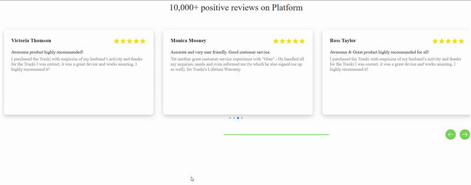

# shopify-review-cards
This is the cards slider for review

If empty [ 

 ] not display on frontend then in particular file add the css below for empty
   # CSS
      <style>
          div:empty { display: block;}
       <style>

